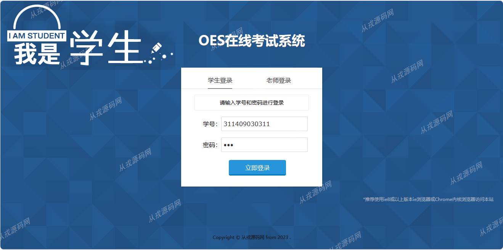
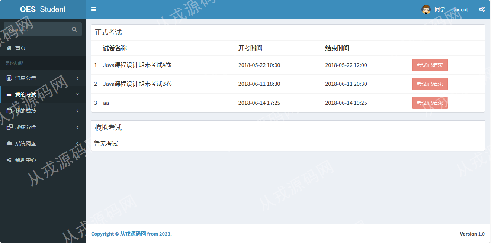
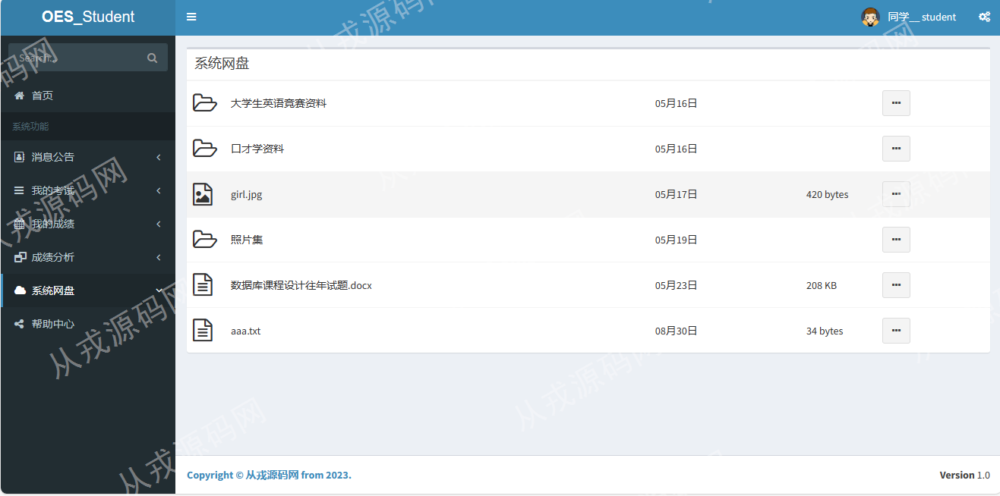
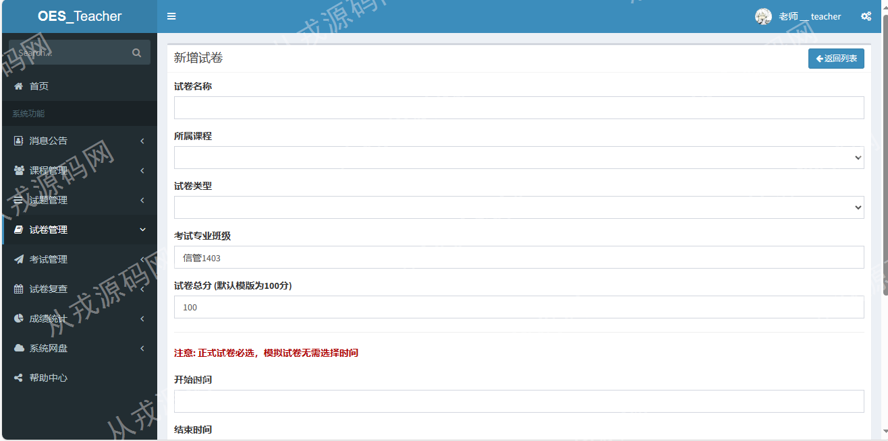

<h1 align="center">51.基于ssm的在线考试管理系统</h1>

###  获取sql数据库文件: 从戎源码网 (https://armycodes.com/) QQ: 386869957 QQ群: 377586148 
###  所有系统地址: (https://github.com/YuLin-Coder/AllProjectCatalog) 微信: yulin-coder
###  所有项目以及源代码本人均调试运行无问题 可支持远程安装部署调试、定制修改、代码讲解

## 简介

> 本代码来源于网络,仅供学习参考使用!
> 
> 管理员登录地址：http://localhost:8080/admin/login
> 管理员：456 123
> 
> 学生和老师登录地址：http://localhost:8080/
> 学生：311409030311 123
> 老师：123 123
> 

## 环境

- <b>IntelliJ IDEA 2009.3</b>

- <b>Mysql 5.7.26</b>

- <b>Tomcat 7.0.73</b>

- <b>JDK 1.8</b>

## 概述
基于ssm的在线考试管理系统：前端：AdminLTE bootstrap jQuery ajax jsp，后端：java8 ssm框架 mvc模式 maven，该考试系统的用户类型有三种：教师、学生、管理员，系统实现了一张试卷从产生到被做再到被评分的一系列过程。

## 系统主要实现功能
### 教师端
* 个人设置：更换密码。
* 课程管理：教师添加自己的任课课程信息，默认一个课程只能有一个老师。
* 试题管理：教师可以通过添加试题丰富题库，也可以对已存在的题目进行修改和删除操作。
* 试卷管理：教师首先创建或选择试卷模版，系统会根据模版自动从题库中抽取题目进行组卷。
* 考试管理：试卷产生后会自动出现在学生考试系统中，若需要取消考试，可以在此处设置。
* 试卷复查：考生的主观题答案会被保存到数据库中，教师可以对其进行复查。
* 成绩统计分析：本系统可以根据特定课程或特定班级使用柱状图，折线图，数据罗列等方式帮助教师更直观得了解学生成绩情况。
* 系统网盘：教师可以上传资料到网盘供学生下载学习
## 学生端
* 个人信息管理：登录密码修改。
* 我的考试：学生进入后会看到试卷信息，当有需要参加的考试时，点击进入即可来到考试界面。
  考试结束系统会自动提交考卷并完成自动改卷任务。
* 我的成绩：展示每门考试的成绩列表。
* 成绩分析：系统会统计出该生本学期参加每门考试的成绩，以及该门课程的平均成绩，使用雷达图进行对比。
* 系统网盘：学生只能下载网盘中的资料,不能上传
## 管理端
* 基本数据管理：对系统内置数据的录入。
* 系统维护：查看系统日志，接收用户问题反馈。
* 系统公告管理：在必要时发布系统公告，如系统版本更新等
* 
## 启动说明
一、 操作环境
1. JDK:1.8
2. Mysql:5.6及以上
3. 编辑器:idea任意版本

二、 初始化数据库
1. 创建数据库
2. 执行SQL文件

三、 idea启动配置
1. 修改配置文件/resources/config.properties中数据库名、用户名称、密码。
2. 点击idea右上角锤子旁边的下拉选择，选择Edit Configuration。
3. 配置一个maven启动，command line设置命令： clean tomcat7:run。
4. 点击旁边的绿色三小按钮运行即可。

## 运行截图

